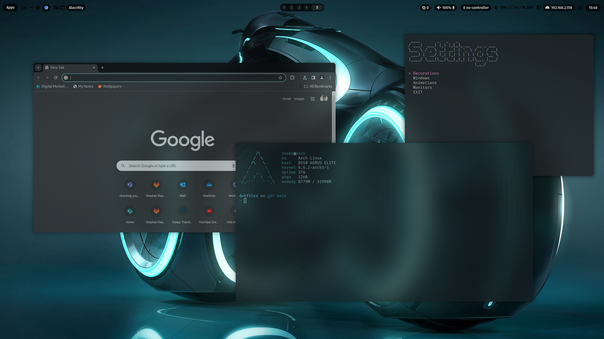
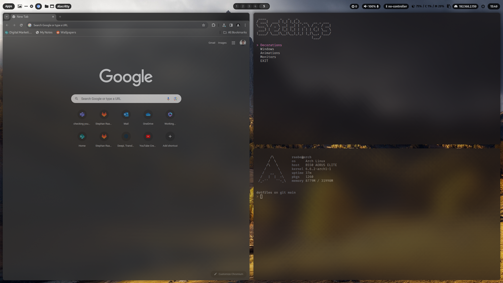
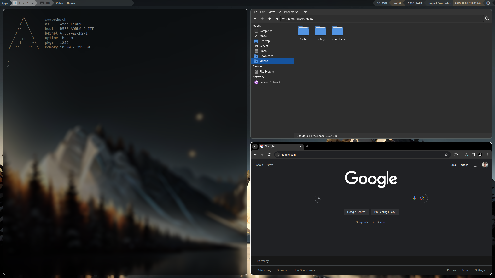
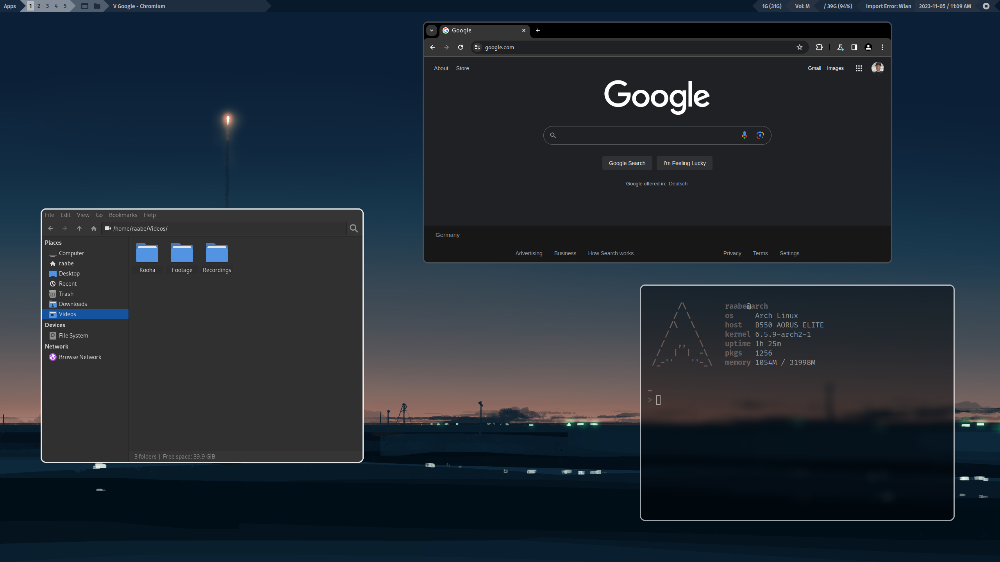
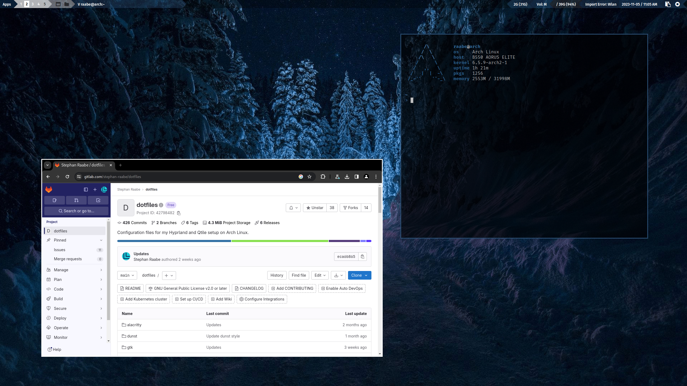
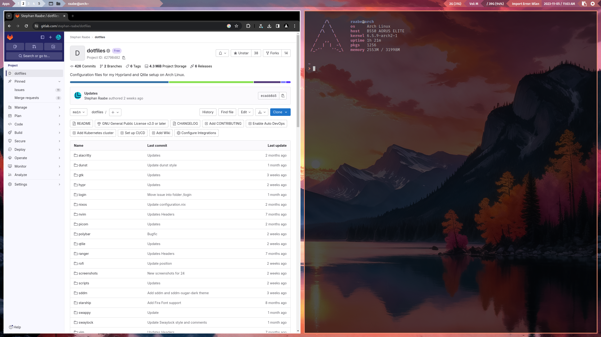

# ML4W dotfiles 2.6

This is my configuration of Hyprland (Wayland) and Qtile (Xorg & Wayland) for Arch. This package includes an installation script to install and setup the required components.

PLEASE NOTE: This branch is the rolling release of my dotfiles and includes the latest changes. 
Please be aware that this version is not a tested release. 

The released dotfiles are tested with Arch Linux, Manjaro Linux, EndeavourOS and Arco Linux.

You can find the video on YouTube: <a href="https://youtu.be/5i_LMMXUDJI" target="_blank">Dotfiles Configuration and Installation</a>

[TOC]

# Installation

To make it easy for you to get started with my dotfiles, here's a list of recommended next steps.
The script will try to create a backup from an previous dotfiles installation.

PLEASE BACKUP YOUR EXISTING .config FOLDER WITH YOUR DOTFILES BEFORE STARTING THE SCRIPTS FOR INITIONAL INSTALLTION.
PLEASE READ THIS README until the end before starting the installation.

## Installation with GIT (Rolling Release of main branch)

```
# 1.) Change into your Downloads folder
cd ~/Downloads

# 2.) Clone the dotfiles repository into the Downloads folder
git clone https://gitlab.com/stephan-raabe/dotfiles.git

# 3.) Change into the dotfiles folder
cd dotfiles

# 4.) Start the installation
./install.sh

```
## Update with GIT (Rolling Release of main branch)
```
# 1.) Change into your Downloads folder
cd ~/Downloads/dotfiles

# 2.) Pull the latest version and update the repository
git stash; git pull

# 3.) Start the installation to update
./install.sh

```

## Update with GIT (Rolling Release of main branch)

You can also update by deleting the ~/Downloads/dotfiles folder and clone again.

```
# 1.) Change into your Downloads folder
cd ~/Downloads

# 2.) Delete existing dotfiles folder from Downloads folder
rm -rf ~/Downloads/dotfiles

# 3.) Clone the dotfiles repository into the Downloads folder
git clone https://gitlab.com/stephan-raabe/dotfiles.git

# 4.) Change into the dotfiles folder
cd dotfiles

# 5.) Start the installation to update
./install.sh

```

## Installation by downloading the latest release

If you don't want to use the rolling release, you can download the latest release the latest release https://gitlab.com/stephan-raabe/dotfiles/-/releases or choose the the latest tag https://gitlab.com/stephan-raabe/dotfiles/-/tags and download the zip.

```
# 1.) Change into your Downloads folder where you have downloaded the release to
cd ~/Downloads

# 2.) Unzip
unzip dotfiles-2.6.zip

# 3.) Change into the new dotfiles folder
cd dotfiles-2.6

# 4.) Start the installation to update
./install.sh

```

You can also use the dotfiles installer script to download and install the latest release: https://gitlab.com/stephan-raabe/installer

## NVIDIA 

There is no official Hyprland support for Nvidia hardware. However, you might make it work properly following this page.
https://wiki.hyprland.org/Nvidia/

That's why NVIDIA GPUs are currently not supported by my dotfiles. But in upcoming releases, I will try to setup Hyprland for NVIDIA based on the article above.

# Some important key bindings

- <kbd>SUPER</kbd> + <kbd>RETURN</kbd>: Alacritty
- <kbd>SUPER</kbd> + <kbd>CMD</kbd> + <kbd>RETURN</kbd>: rofi application launcher
- <kbd>SUPER</kbd> + <kbd>SHIFT</kbd> + <kbd>W</kbd>: Change wallpaper
- <kbd>SUPER</kbd> + <kbd>PRINT</kbd>: Screenshot
- <kbd>SUPER</kbd> + <kbd>CMS</kbd> + <kbd>Q</kbd>: Logout screen

All keybindings for Hyprland with right mouse click on Apps in waybar or here: 
https://gitlab.com/stephan-raabe/dotfiles/-/blob/main/hypr/conf/keybindings.conf?ref_type=heads

All keybindings for Qtile: https://gitlab.com/stephan-raabe/dotfiles/-/blob/main/qtile/config.py?ref_type=heads

## Installation in a KVM virtual machine

Qtile X11 works fine in a KVM virtual machine. The Hyprland performance is low but it's enough for testing new features.

In virt-manager please make sure that 3D acceleration is enabled in Video Virtio and the Listen type is set to None in Display Spice.

To fix the mouse issue on Hyprland, open the Hyprland settings with SUPER+CMS+S and select in Environments the variation kvm.conf

# Templating & Settings

Hyprland & Qtile: Included is a pywal configuration that changes the color scheme based on a randomly selected wallpaper. With the key binding SuperKey + Shift + W you can change the wallpaper. SuperKey + Ctrl + W opens rofi with a list of installed wallpapers for your individual selection. See also the .bashrc and the key bindings on Hyprland and Qtile for more alias definitions.

Hyprland: In addition, you can switch the Waybar Template with SUPER + CTRL + T or by pressing the "..." icon in Waybar. The templates are available in ~/dotfiles/waybar/themes. You can add your own personal themes into this folder. The script will read in the folder structure. You can open the settings script with SUPER + CMD + S to select variations for your hyprland.conf and customize your desktop even more.

Qtile X11: In addition, you can switch between the Qtile status bar and Polybar with SUPER + SHIFT + S 

# Screenshots

## Hyprland

<a href="https://youtu.be/5i_LMMXUDJI" target="_blank"></a>

<a href="https://youtu.be/5i_LMMXUDJI" target="_blank"></a>

<a href="https://youtu.be/5i_LMMXUDJI" target="_blank">Watch on YouTube</a>

## Qtile X11

<a href="https://youtu.be/5i_LMMXUDJI" target="_blank"></a>

<a href="https://youtu.be/5i_LMMXUDJI" target="_blank"></a>

<a href="https://youtu.be/5i_LMMXUDJI" target="_blank">Watch on YouTube</a>

## Qtile Wayland

<a href="https://youtu.be/5i_LMMXUDJI" target="_blank"></a>

<a href="https://youtu.be/5i_LMMXUDJI" target="_blank"></a>

<a href="https://youtu.be/5i_LMMXUDJI" target="_blank">Watch on YouTube</a>

<b><a href="https://gitlab.com/stephan-raabe/dotfiles/-/tree/main/screenshots?ref_type=heads">You can find more screenshots here.</a></b>

# Screensharing and recording on Hyprland

In case you have issues with starting Waybar please make sure that only one xdg-desktop-portal-x is installed additionally to xdg-desktop-portal.

I had several issues with xdg-desktop-portal-wlr on Hyprland and Waybar. Please make sure that xdg-desktop-portal-wlr is uninstalled and xdg-desktop-portal-hyprland is installed.

More information you can find here:
https://gist.github.com/PowerBall253/2dea6ddf6974ba4e5d26c3139ffb7580

Please note that every Arch Linux system is different and I cannot guarantee that everything works fine on your system.

# Packages

## General

- Terminal: alacritty
- Editor: nvim
- Prompt: starship
- Icons: Font Awesome
- Launch Menus: Rofi
- Colorscheme: pywal
- Browsers: chromium (brave optional)
- Filemanager: Thunar
- Cursor: Bibata Modern Ice
- Icons: Papirus-Icon-Theme

## Hyprland 

- Status Bar: waybar
- Screenshots: grim & slurp
- Clipboard Manager: cliphist
- Logout: wlogout 
- Screenlock: swaylock-effects

## Qtile Wayland

- Status Bar: Qtile status bar
- Screenshots: grim & slurp
- Clipboard Manager: cliphist
- Logout: rofi power menu
- Screenlock: swaylock-effects

## Qtile X11

- Compositor: picom
- Status Bar: Qtile status bar + Polybar (optional)
- Screenshots: scrot
