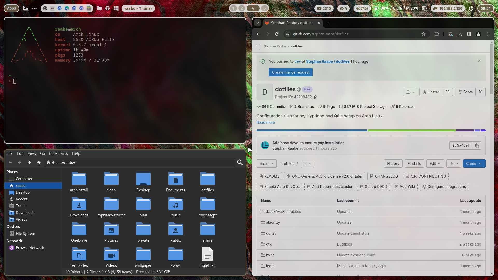

# ML4W dotfiles

This is my configuration of Hyprland (Wayland) and Qtile (Xorg).
This package includes installation scripts to install and setup the required components.

The dotfiles are tested with Arch Linux, Manjaro Linux, EndeavourOS and Arco Linux.

## Common Packages

- Terminal: alacritty
- Editor: nvim
- Prompt: starship
- Icons: Font Awesome
- Menus: Rofi
- Colorscheme: pywal (dynamic)
- Browsers: chromium (brave optional)
- Filemanager: Thunar
- Cursor: Bibata Modern Ice
- Icons: Papirus-Icon-Theme
- Virtual Machine: qemu (Windows 11 with looking glass and xrdp)

## Hyprland

- Status Bar: waybar
- Screenshots: grim & slurp
- Clipboard Manager: cliphist
- Logout: wlogout
- Screenlock: swaylock-effects

## Qtile

- Compositor: picom
- Status Bar: polybar
- Screenshots: scrot

## Templating

Hyprland & Qtile: Included is a pywal configuration that changes the color scheme based on a randomly selected wallpaper. With the key binding SuperKey + Shift + w you can change the wallpaper. SuperKey + Ctrl + w opens rofi with a list of installed wallpapers for your individual selection. See also the .bashrc and the key bindings on Hyprland and Qtile for more alias definitions.

Hyprland: In addition, you can switch the Waybar Template with SUPER + CTRL + T or by pressing the "..." icon in Waybar. The templates are available in ~/dotfiles/waybar/themes. You can add your own personal themes into this folder. The script will read in the folder structure.

## Screenshots & Video

<a href="https://youtu.be/mJ9m18-7pQk" target="_blank">Watch on YouTube</a>

<a href="https://youtu.be/mJ9m18-7pQk" target="_blank"></a>

<a href="https://youtu.be/mJ9m18-7pQk" target="_blank"></a>

<a href="https://youtu.be/mJ9m18-7pQk" target="_blank"></a>

<a href="https://youtu.be/mJ9m18-7pQk" target="_blank"></a>

<a href="https://youtu.be/mJ9m18-7pQk" target="_blank">Watch on YouTube</a>

<b><a href="https://gitlab.com/stephan-raabe/dotfiles/-/tree/main/screenshots?ref_type=heads">You can find more screenshots here.</a></b>

## Getting started

To make it easy for you to get started with my dotfiles, here's a list of recommended next steps.

PLEASE BACKUP YOUR EXISTING .config WITH YOUR DOTFILES BEFORE STARTING THE SCRIPTS.

```
# Make sure that you're in your home directory
cd

# Clone the repository from your home directory
git clone https://gitlab.com/stephan-raabe/dotfiles.git

# Or download the lastest version and unzip into ~/dotfiles folder

# Change into the new dotfiles folder
cd dotfiles

# Install all required packages
./1-install.sh

# Install hyprland window manager
./2-install-hyprland.sh
# OR/AND Install qtile window manager
./2-install-qtile.sh

# Install dotfiles
./3-install-dotfiles.sh

```
Please note that every Arch Linux system is different and I cannot guarantee that everything works fine on your system.

