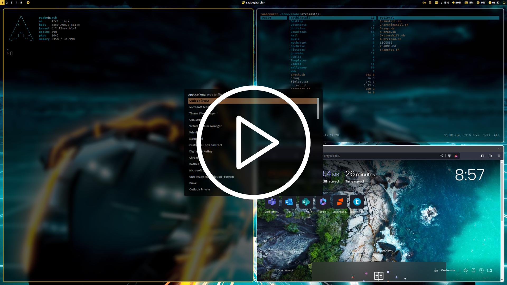

# dotfiles
 __  __ _    _  ___        __      _       _    __ _ _            
|  \/  | |  | || \ \      / /   __| | ___ | |_ / _(_) | ___  ___  
| |\/| | |  | || |\ \ /\ / /   / _` |/ _ \| __| |_| | |/ _ \/ __| 
| |  | | |__|__   _\ V  V /   | (_| | (_) | |_|  _| | |  __/\__ \ 
|_|  |_|_____| |_|  \_/\_/     \__,_|\___/ \__|_| |_|_|\___||___/ 
                                                                   
by Stephan Raabe (2023) 
----------------------------------------------------- 

This is the configuration of my Arch linux based installation.

- Window Manager: qtile
- Compositor: picom
- Terminal: alacritty
- Editor: nvim
- Prompt: starship
- Bar: polybar
- Icons: Font Awesome
- Menus: Rofi
- Colorscheme: pywal (dynamic)
- Browser: brave
- Filemanager: ranger, Thunar
- Screenshots: scrot
- Cursor: Bibata Modern Classic
- Icons: breeze-dark
- Theme: Breeze-dark
- Virtual Machine: qemu (Windows 11 with looking glass and xrdp)

Please also see the script folder how I setup my system.

Included is a pywal configuration that changes the color scheme based on a randomly selected wallpaper. Just type w in a terminal (or SuperKey + Shift + w). SuperKey + Ctrl + w opens rofi with a list of installed wallpapers for individual selection. See also the .bashrc for more alias definitions.

## Screenshots & Video

<a href="http://www.youtube.com/watch?feature=player_embedded&v=WHxgeWzGoBY" target="_blank"></a>

You can find more screenshots in the screenshots folder.

## Getting started

To make it easy for you to get started with my dotfiles, here's a list of recommended next steps.

```
# Clone the repository
git clone https://gitlab.com/stephan-raabe/dotfiles.git

# Install or update all required packages and install dotfiles
./1-install.sh

# Install qtile window manager
./2-qtile.sh

```


