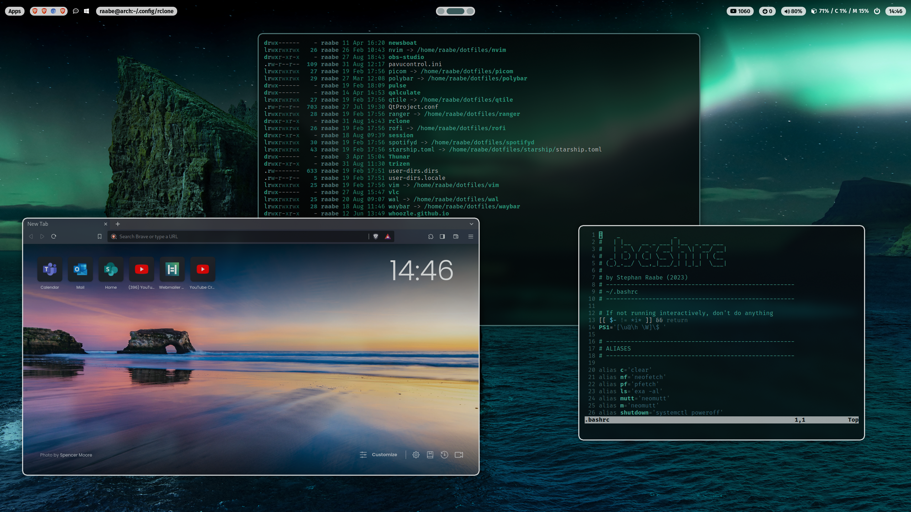

# ML4W dotfiles

This is the configuration of my Arch linux based installation.
I'm using the Hyprland (Wayland) and Qtile (Xorg).

## Common Packages

- Terminal: alacritty
- Editor: nvim
- Prompt: starship
- Icons: Font Awesome
- Menus: Rofi
- Colorscheme: pywal (dynamic)
- Browsers: brave, chromium
- Filemanager: ranger, Thunar
- Cursor: Bibata Modern Classic
- Icons: breeze-dark
- Theme: Breeze-dark
- Virtual Machine: qemu (Windows 11 with looking glass and xrdp)

## Hyprland

- Status Bar: waybar
- Screenshots: grim

## Qtile

- Compositor: picom
- Status Bar: polybar
- Screenshots: scrot

## Templating

Included is a pywal configuration that changes the color scheme based on a randomly selected wallpaper. Just type w in a terminal (or SuperKey + Shift + w). SuperKey + Ctrl + w opens rofi with a list of installed wallpapers for individual selection. See also the .bashrc for more alias definitions.

## Screenshots & Video

<a href="http://www.youtube.com/watch?feature=player_embedded&v=EujO_5KvCCo" target="_blank"></a>
<a href="http://www.youtube.com/watch?feature=player_embedded&v=EujO_5KvCCo" target="_blank">Watch on YouTube</a>


You can find more screenshots in the screenshots folder.

## Getting started

To make it easy for you to get started with my dotfiles, here's a list of recommended next steps.

```
# Clone the repository
git clone https://gitlab.com/stephan-raabe/dotfiles.git

# Install or update all required packages and install dotfiles
./1-install.sh

# Install qtile window manager
./2-install-hyprland.sh

# Install qtile window manager
./2-install-qtile.sh

```


