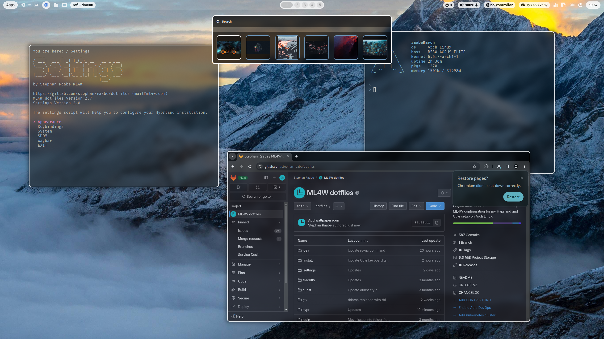
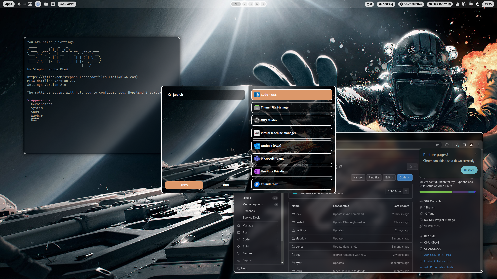

# ML4W dotfiles 2.7

This is my configuration of Hyprland (Wayland) and Qtile (X11) for Arch Linux based distributions. This package includes an installation script to install and setup the required components.

<a href="https://youtu.be/e9ro_P9rbFk" target="_blank"></a>

PLEASE NOTE: This branch is the rolling release of my dotfiles and includes the latest changes. 
Please be aware that this version is not a tested release. 

You can find the video on YouTube: <a href="https://youtu.be/e9ro_P9rbFk" target="_blank">Dotfiles Configuration and Installation</a>

[TOC]

# Installation

To make it easy for you to get started with the ML4W dotfiles, here's a list of recommended next steps.

The package includes an installation script install.sh that will guide you through all steps of the installation or update process.

## Supported platforms

The dotfiles are tested with the following Arch based distributions:

- Arch Linux (recommended)
- Manjaro Linux
- Arco Linux
- EndeavourOS

But the installation should work on all Arch Linux based distributions as well.

For Arco Linux users: Please reinstall/force the installation of all packages during the installation/update process of the install script. The script will also offer to remove ttf-ms-fonts if installed to avoid issues with icons on waybar. 

## Before you start

PLEASE BACKUP YOUR EXISTING .config FOLDER WITH YOUR DOTFILES BEFORE STARTING THE SCRIPTS FOR INITIONAL INSTALLTION.
PLEASE READ THIS README until the end before starting the installation.

The installation script will try to create a backup from an previous dotfiles installation.

Please note: To get the default Linux folder structure incl. Downloads, etc please install the packages xdg-user-dirs and run xdg-user-dirs-update.

## Installation with GIT (Rolling Release of main branch)

```
# 1.) Change into your Downloads folder
cd ~/Downloads

# 2.) Clone the dotfiles repository into the Downloads folder
git clone https://gitlab.com/stephan-raabe/dotfiles.git

# 3.) Change into the dotfiles folder
cd dotfiles

# 4.) Start the installation
./install.sh

```
## Update with GIT (Rolling Release of main branch)
```
# 1.) Change into your Downloads folder
cd ~/Downloads/dotfiles

# 2.) Pull the latest version and update the repository
git stash; git pull

# 3.) Start the installation to update
./install.sh

```

## Update with GIT (Rolling Release of main branch) (fresh update)

You can also update by deleting the ~/Downloads/dotfiles folder and clone again.

```
# 1.) Change into your Downloads folder
cd ~/Downloads

# 2.) Delete existing dotfiles folder from Downloads folder
rm -rf ~/Downloads/dotfiles

# 3.) Clone the dotfiles repository into the Downloads folder
git clone https://gitlab.com/stephan-raabe/dotfiles.git

# 4.) Change into the dotfiles folder
cd dotfiles

# 5.) Start the installation to update
./install.sh

```

## Installation by downloading the latest release

If you don't want to use the rolling release, you can download the latest release the latest release https://gitlab.com/stephan-raabe/dotfiles/-/releases or choose the the latest tag https://gitlab.com/stephan-raabe/dotfiles/-/tags and download the zip.

```
# 1.) Change into your Downloads folder where you have downloaded the release to
cd ~/Downloads

# 2.) Unzip
unzip dotfiles-2.6.zip

# 3.) Change into the new dotfiles folder
cd dotfiles-2.6

# 4.) Start the installation to update
./install.sh

```

You can also use the dotfiles installer script to download and install the latest release: https://gitlab.com/stephan-raabe/installer

## Installation Hook

The installation script will prepare the configuration files in a folder ~/dotfiles-versions/[version] before copying into the final destination in ~/dotfiles

If you want to modify the installation files just before the copy procedure starts, you can create a file hook.sh in the folder ~/dotfiles-versions

You can delete folders and files or update existing configurations.

```
#!/bin/bash
rm -rf ~/dotfiles-versions/$version/vim/
rm -rf ~/dotfiles-versions/$version/nvim/
```

This script will for example remove the vim and nvim folder before the installation. The symbolic link will not be created because the source folder doesn't exits.

You can find a template in .install/templates/hook.sh

## Hyprland & NVIDIA 

Users have reported that Hyprland with dotfiles could be installed successfully on setups with NVDIA GPUs using the nouveau open source drivers. 

There is no official Hyprland support for Nvidia hardware. However, you might make it work properly following this page.
https://wiki.hyprland.org/Nvidia/

## Display Manager SDDM

The suggested method to start Hyprland is with the tty with the command Hyprland. But I made good experiences with the Display Manager SDDM (https://github.com/sddm/sddm) but you can also install a custom issue to improve the tty based login.

Important is that you use the package sddm-git. You can replace sddm with sddm-git with
```
yay -S sddm-git
```

The dotfiles installation script will offer to deactivate the installed display manager and to activate  SDDM. 

The dotfiles package also includes a configuration for the SDDM theme sdd-sugar-candy (https://github.com/Kangie/sddm-sugar-candy) and a configuration to run SDDM in X11 mode to get the best compatibility.

With the Hyprland settings script you can copy the current wallpaper into SDDM and use it as a background.

## Installation in a KVM virtual machine

Qtile X11 works fine in a KVM virtual machine. The Hyprland performance is low but it's enough for testing new features.

In virt-manager please make sure that 3D acceleration is enabled in Video Virtio and the Listen type is set to None in Display Spice.

To fix the mouse issue on Hyprland, open the Hyprland settings with <kbd>SUPER</kbd> + <kbd>CTRL</kbd> + <kbd>S</kbd> and select in Environments the variation kvm.conf

## Base Hyprland installation with Hyperland Starter

If you want to install only the core packages of Hyprland as a starting point for your Hyprland experiments please also try my Hyprland Starter script: https://gitlab.com/stephan-raabe/hyprland-starter

## Known issues

In case of missing icons on waybar, it's due to a conflict between several installed fonts (can happen especially on Arco Linux). Please make sure that ttf-ms-fonts is uninstalled and ttf-font-awesome and otf-font-awesome are installed with

```
yay -R ttf-ms-fonts
yay -S ttf-font-awesome otf-font-awesome
```

# Some important key bindings

- <kbd>SUPER</kbd> + <kbd>RETURN</kbd>: Alacritty
- <kbd>SUPER</kbd> + <kbd>CTRL</kbd> + <kbd>RETURN</kbd>: rofi application launcher
- <kbd>SUPER</kbd> + <kbd>SHIFT</kbd> + <kbd>W</kbd>: Change wallpaper
- <kbd>SUPER</kbd> + <kbd>PRINT</kbd>: Screenshot
- <kbd>SUPER</kbd> + <kbd>CTRL</kbd> + <kbd>Q</kbd>: Logout screen
- <kbd>SUPER</kbd> + <kbd>CTRL</kbd> + <kbd>S</kbd>: Settings script on Hyprland
- <kbd>SUPER</kbd> + <kbd>SHIFT</kbd> + <kbd>B</kbd>: Reload waybar on Hyprland

All keybindings for Hyprland with right mouse click on Apps in waybar or here: 
https://gitlab.com/stephan-raabe/dotfiles/-/blob/main/hypr/conf/keybindings.conf

All keybindings for Qtile: https://gitlab.com/stephan-raabe/dotfiles/-/blob/main/qtile/config.py

# Hyprland

<a href="https://youtu.be/e9ro_P9rbFk" target="_blank"></a>

<a href="https://youtu.be/e9ro_P9rbFk" target="_blank"></a>

<b><a href="https://gitlab.com/stephan-raabe/dotfiles/-/tree/main/screenshots?ref_type=heads">You can find more screenshots here.</a></b>

<a href="https://youtu.be/e9ro_P9rbFk" target="_blank">Watch on YouTube</a>

## Wallpaper and Pywal

Included is a pywal configuration that changes the color scheme based on a randomly selected wallpaper. With the key binding <kbd>SUPER</kbd> + <kbd>SHIFT</kbd> + <kbd>W</kbd> you can change the wallpaper coming from the folder ~/wallpaper/. 

<kbd>SUPER</kbd> + <kbd>CTRL</kbd> + <kbd>W</kbd> opens rofi with a list of installed wallpapers in ~/wallpaper/ for your individual selection. 

## Waybar themes and themeswitcher

In addition, you can switch the Waybar Template with <kbd>SUPER</kbd> + <kbd>CTRL</kbd> + <kbd>T</kbd> or by pressing the "..." icon in Waybar with the themeswitcher. 

The templates are available in ~/dotfiles/waybar/themes. You can add your own personal themes into this folder. 

More information here: https://gitlab.com/stephan-raabe/dotfiles/-/tree/main/waybar

## Hyprland settings

You can open the settings script with <kbd>SUPER</kbd> + <kbd>CTRL</kbd> + <kbd>S</kbd> to select variations for your hyprland.conf and customize your desktop even more.

You can create custom variations by copying a file from the ~/dotfiles/hypr/conf subfolders like monitor/default.conf, give the file a custom name (e.g., mymonitor.conf) and select the variation in the settings script in the corresponding section.

You can also edit the file custom.conf which is included at the bottom of the hyprland.conf and can hold you personal configurations.

You can also edit the file directly in the settings script in the section Custom.

## Screensharing and recording

In case you have issues with starting Waybar please make sure that only one xdg-desktop-portal-x is installed additionally to xdg-desktop-portal.

I had several issues with xdg-desktop-portal-wlr on Hyprland and Waybar. Please make sure that xdg-desktop-portal-wlr is uninstalled and xdg-desktop-portal-hyprland is installed.

More information you can find here:
https://gist.github.com/PowerBall253/2dea6ddf6974ba4e5d26c3139ffb7580

Please note that every Arch Linux system is different and I cannot guarantee that everything works fine on your system.

## Main packages

- Terminal: alacritty
- Editor: nvim
- Prompt: starship
- Icons: Font Awesome
- Launch Menus: Rofi
- Colorscheme: pywal
- Browsers: chromium (brave optional)
- Filemanager: Thunar
- Cursor: Bibata Modern Ice
- Icons: Papirus-Icon-Theme
- Status Bar: waybar
- Screenshots: grim & slurp
- Clipboard Manager: cliphist
- Logout: wlogout 
- Screenlock: swaylock-effects

# Qtile X11

<a href="https://youtu.be/e9ro_P9rbFk" target="_blank"></a>

<a href="https://youtu.be/e9ro_P9rbFk" target="_blank"></a>

## Wallpaper and Pywal

Included is a pywal configuration that changes the color scheme based on a randomly selected wallpaper. With the key binding <kbd>SUPER</kbd> + <kbd>SHIFT</kbd> + <kbd>W</kbd> you can change the wallpaper coming from the folder ~/wallpaper/. 

<kbd>SUPER</kbd> + <kbd>CTRL</kbd> + <kbd>W</kbd> opens rofi with a list of installed wallpapers in ~/wallpaper/ for your individual selection. 

## Qtile status bar switcher

With <kbd>SUPER</kbd> + <kbd>SHIFT</kbd> + <kbd>S</kbd>, you can switch between the Qtile standard status bar and Polybar and back. 

## Main Packages

- Terminal: alacritty
- Editor: nvim
- Prompt: starship
- Icons: Font Awesome
- Launch Menus: Rofi
- Colorscheme: pywal
- Browsers: chromium (brave optional)
- Filemanager: Thunar
- Cursor: Bibata Modern Ice
- Icons: Papirus-Icon-Theme
- Status Bar: Qtile status bar + Polybar (optional)
- Compositor: picom
- Screenshots: scrot

# Wallpaper repository

You can find my wallpaper collection in the repository https://gitlab.com/stephan-raabe/wallpaper

# Special Thanks

THANK YOU very much for all your support, contributions and ideas:

- Diana Ward: https://github.com/dianaw353
- Don Williams: https://github.com/dwilliam62
- Teodor Orzechowski: https://gitlab.com/sq6gtt
- Jamie Deppeler: https://gitlab.com/bknight2k

and many more...

Thanks to all YouTube subscribers for all your great feedback.

# Inspirations

The following projects have inspired me:

- https://github.com/dianaw353/hyprland-configuration-rootfs
- https://github.com/prasanthrangan/hyprdots
- https://github.com/sudo-harun/dotfiles

and many more...
