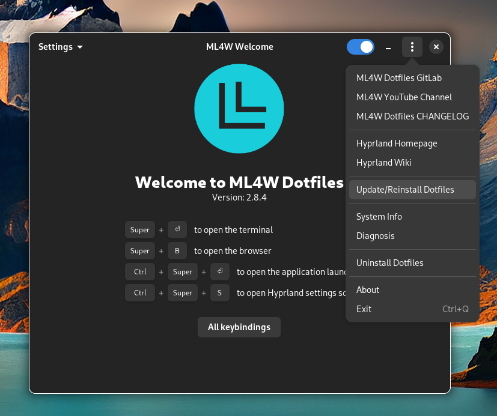
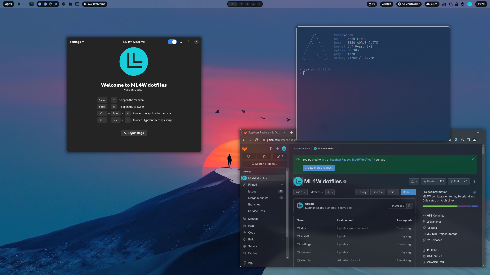
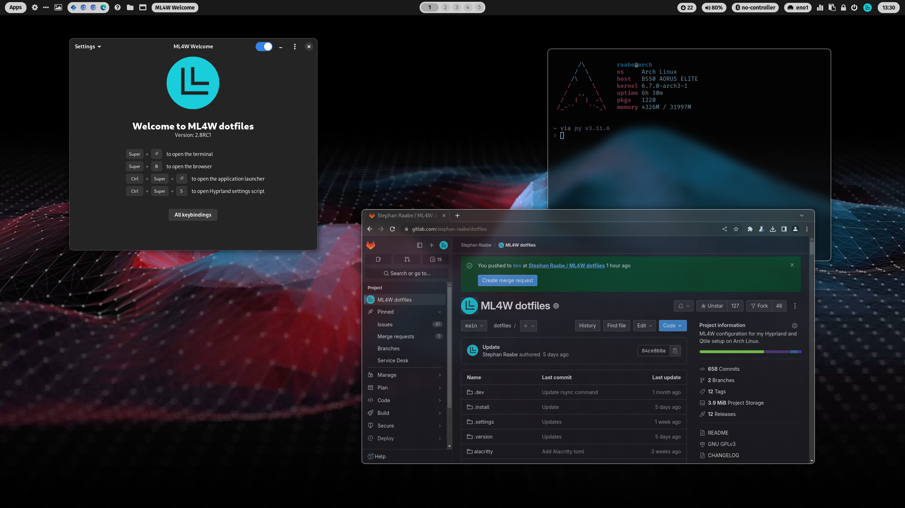
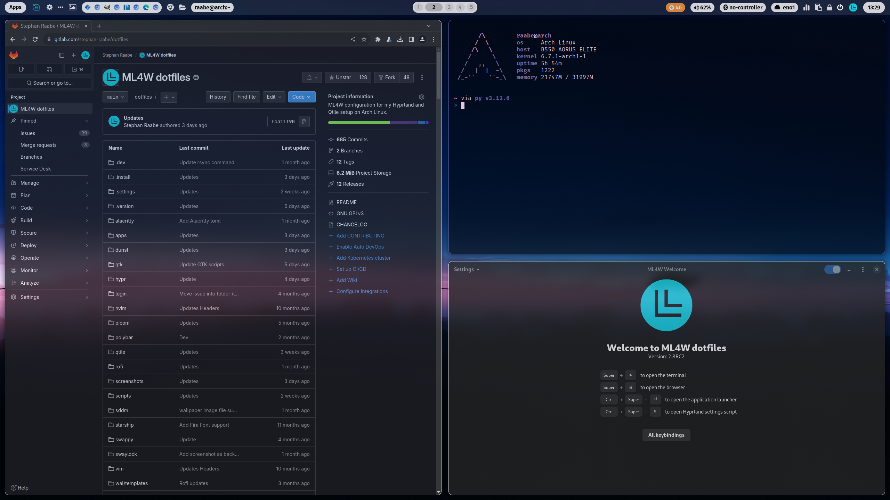
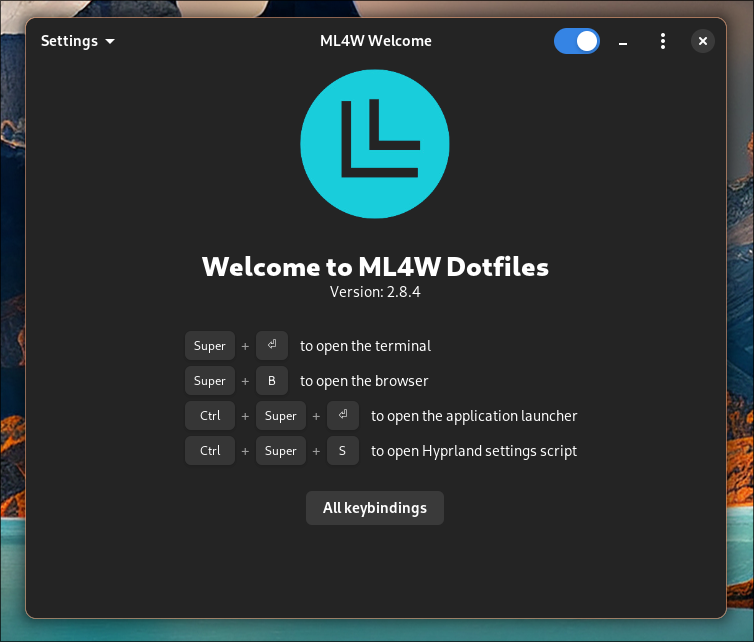
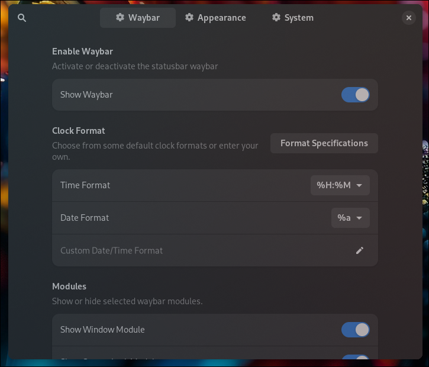
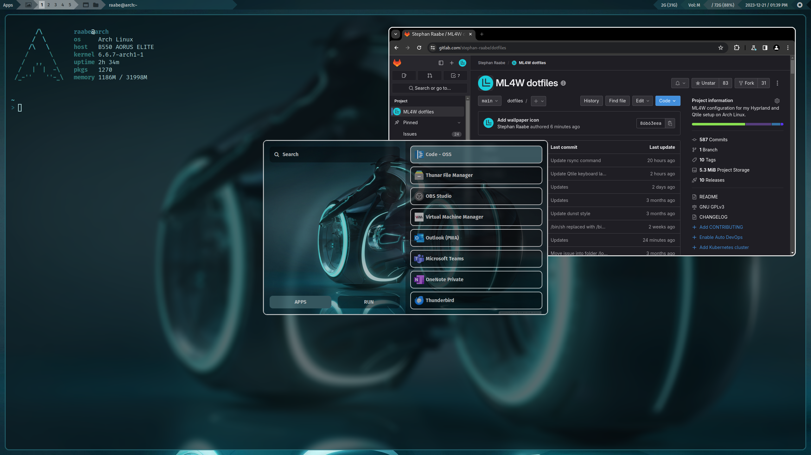
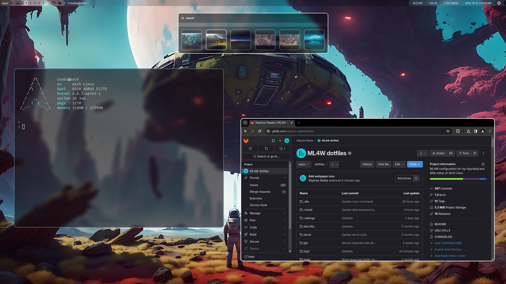

# ML4W Dotfiles 2.8.3.2

An advanced configuration of Hyprland and Qtile for Arch Linux based distributions. This package includes an installation script to install and setup the required components.

[](screenshots/v283/screenshot-283-2.png)

You can find the overview video (Version 2.8.3) on Youtube: [ML4W Dotfiles 2.8.3](https://youtu.be/zM2AYue0o8s)

You can find the installation video (Version 2.8.2) on YouTube: [Install/Update the ML4W Dotfiles](https://youtu.be/n6Yg232bCOU)

> PLEASE NOTE: In case of issues with the latest Hyprland version 0.37.1, please update your ML4W Dotfiles installation to the latest version. See the troubleshooting section for more information.

The ML4W Dotfiles are available as 

- main release (Official release): [https://gitlab.com/stephan-raabe/dotfiles](https://gitlab.com/stephan-raabe/dotfiles)
- rolling release (Development release): [https://gitlab.com/stephan-raabe/dotfiles/-/tree/dev](https://gitlab.com/stephan-raabe/dotfiles/-/tree/dev)

[TOC]

# Installation

To make it easy for you to get started with the ML4W dotfiles, here's a list of recommended next steps.

The package includes an installation script install.sh that will guide you through all steps of the installation or update process.

> PLEASE NOTE: Every Linux distribution and setup can be different. Therefore, I cannot guarantee that the installation will work smoothly everywhere. Installation on your own risk.

## Supported platforms

The dotfiles are tested with the following Arch based distributions:

- Arch Linux (recommended)
- EndeavourOS
- Arco Linux
- Manjaro Linux

The installation should work on all Arch Linux based distributions as well.

> **For Manjaro users:** Hyprland and required components are under ongoing development. That's why it's possible that some packages are not immediatly available on Manjaro e.g., hyprlock or hypridle. But usually, the packages will be published later.

> **For Arco Linux users:** Please reinstall/force the installation of all packages during the installation/update process of the install script. The script will also offer to remove ttf-ms-fonts if installed to avoid issues with icons on waybar. 

## Before you start

**PLEASE BACKUP YOUR EXISTING .config FOLDER WITH YOUR DOTFILES BEFORE STARTING THE SCRIPTS FOR INITIAL INSTALLTION.**

The installation script will create a backup from an previous dotfiles installation.

If possible, please create a snapshot of your current system if snapper or Timeshift is installed and available.

## ML4W Installer App

The easiest way to install the ML4W Dotfiles is to use the ML4W Dotfiles Installer App. [You can download the app here.](https://gitlab.com/stephan-raabe/dotfiles/-/raw/main/apps/ML4W_Dotfiles_Installer.AppImage) (Right click + Save link as...)

```
# Change to the download location (normally the Downloads folder)
cd ~/Downloads

# Make the file executable
chmod +x ML4W_Dotfiles_Installer.AppImage

# Start the App from your terminal with
./ML4W_Dotfiles_Installer.AppImage
```

## Installation with GIT

You can also install the dotfiles by cloning the latest main release:

```
# 1.) Change into your Downloads folder (create the folder if not available)
cd ~/Downloads

# 2.) Clone the dotfiles repository into the Downloads folder
git clone --depth=1 https://gitlab.com/stephan-raabe/dotfiles.git

# 3.) Change into the dotfiles folder
cd dotfiles

# 4.) Start the installation
./install.sh

```

## Installation with GIT of the rolling release

You can install the dotfiles by cloning the latest development version from the rolling release:

```
# 1.) Change into your Downloads folder (create the folder if not available)
cd ~/Downloads

# 2.) Clone the dotfiles repository into the Downloads folder
git clone https://gitlab.com/stephan-raabe/dotfiles.git

# 3.) Change into the new dotfiles folder
cd dotfiles

# 4.) Checkout the dev branch
git checkout dev

# 4.) Start the installation
./install.sh

```

## Update

From 2.8.2 onwards you can use the integrated update feature to update your dotfiles to the main or rolling release whenever you want.



You can also use the ML4W installer to update to the main-release (Latest Version) or the Rolling Release: https://gitlab.com/stephan-raabe/installer

You can force a clean re-installation of the dotfiles by removing the folder ~/dotfiles before starting the installation.

> Please note that you can create a backup of your existing configuration with the backup feature of the install script. It's recommended to remove the folder ~/dotfiles only after creating a backup. 

Please follow the steps to update from earlier dotfiles versions to 2.8.3

```
# 1.) Remove existing downloaded dotfiles
rm -rf ~/Downloads/dotfiles

# 2.) Change into your Downloads folder
cd ~/Downloads

# 3.) Clone the dotfiles repository into the Downloads folder
git clone --depth=1 https://gitlab.com/stephan-raabe/dotfiles.git

# 4.) Change into the dotfiles folder
cd dotfiles

# 5.) Start the installation
./install.sh

```

## Installation Hook

The installation script will prepare the configuration files in a folder ~/dotfiles-versions/[version] before copy the files into the final destination in ~/dotfiles

If you want to modify the installation files just before everytime the copy procedure starts, you can create a file hook.sh in the folder ~/dotfiles-versions

You can for example delete folders and files or update existing configurations.

```
#!/bin/bash
rm -rf ~/dotfiles-versions/$version/vim/
rm -rf ~/dotfiles-versions/$version/nvim/
```

This script will for example remove the vim and nvim folder before the installation. The symbolic link will not be created because the source folder doesn't exits.

You can find a template in .install/templates/hook.sh

## Hyprland & NVIDIA 

There is no official Hyprland support for Nvidia hardware. However, you might make it work properly following this page.
https://wiki.hyprland.org/Nvidia/

Users have reported that Hyprland with dotfiles could be installed successfully on setups with NVDIA GPUs using the nouveau open source drivers. 

Please select the following variation in the settings script (system/environment):

https://gitlab.com/stephan-raabe/dotfiles/-/blob/main/hypr/conf/environments/nvidia.conf

Or set the included environment variables in hyprland.conf

## Launch Hyprland from tty

The suggested method to start Hyprland is from tty with the command Hyprland because login managers (display managers) are not officially supported (https://wiki.hyprland.org/Getting-Started/Master-Tutorial/#launching-hyprland)

```
# Start Hyprland
Hyprland
```

You can install a custom tty login issue (layout) with the dotfiles installer.

## Launch Hyprland with a Display Manager

I made good experiences with the Display Manager SDDM (https://github.com/sddm/sddm). Also gdm could work. 

```
yay -S sddm
```

The dotfiles installation script will offer to deactivate the installed display manager and to activate SDDM. 

The dotfiles package also includes a configuration for the SDDM theme sdd-sugar-candy (https://github.com/Kangie/sddm-sugar-candy) and a configuration to run SDDM in X11 mode to get the best compatibility.

With the Hyprland settings script you can copy the current wallpaper into SDDM and use it as a background.

Please check the troubleshooting section in case of issues.

## Screenlock, suspend and DPMS

Hypridle will start Hyprlock after 10 minutes of inactivity and will try to suspend one minutes later.

In the ML4W Dotfiles Settings App you can define the timeouts for Hyprlock, suspend and DPSM.

The selected hypridle configuration can be restored from the ML4W installer during a dotfiles update.

## Installation in a KVM virtual machine

Qtile X11 works fine in a KVM virtual machine. The Hyprland performance is low but it's enough for testing new features.

In virt-manager please make sure that 3D acceleration is enabled in Video Virtio and the Listen type is set to None in Display Spice.

To fix the mouse issue on Hyprland, open the Hyprland settings with <kbd>SUPER</kbd> + <kbd>CTRL</kbd> + <kbd>S</kbd> and select in Environments the variation kvm.conf

## Base Hyprland installation with Hyperland Starter

If you want to install only the core packages of Hyprland as a starting point for your Hyprland experiments please also try my Hyprland Starter script: https://gitlab.com/stephan-raabe/hyprland-starter

# Some important key bindings

- <kbd>SUPER</kbd> + <kbd>RETURN</kbd>: Alacritty
- <kbd>SUPER</kbd> + <kbd>CTRL</kbd> + <kbd>RETURN</kbd>: rofi application launcher
- <kbd>SUPER</kbd> + <kbd>SHIFT</kbd> + <kbd>W</kbd>: Change wallpaper
- <kbd>SUPER</kbd> + <kbd>PRINT</kbd>: Screenshot
- <kbd>SUPER</kbd> + <kbd>CTRL</kbd> + <kbd>Q</kbd>: Logout screen
- <kbd>SUPER</kbd> + <kbd>CTRL</kbd> + <kbd>S</kbd>: Settings script on Hyprland
- <kbd>SUPER</kbd> + <kbd>SHIFT</kbd> + <kbd>B</kbd>: Reload waybar on Hyprland

All keybindings for Hyprland with right mouse click on Apps in waybar or here: 

- [Hyprland keybindings overview](hypr/conf/keybindings.conf)
- [Qtile keybindings overview](qtile/config.py)

# Hyprland

<a href="https://gitlab.com/stephan-raabe/dotfiles/-/blob/main/screenshots/v28/screenshot-28-1.png?ref_type=heads" target="_blank"></a>

<a href="https://gitlab.com/stephan-raabe/dotfiles/-/blob/main/screenshots/v28/screenshot-28-2.png?ref_type=heads" target="_blank"></a>

<a href="https://gitlab.com/stephan-raabe/dotfiles/-/blob/main/screenshots/v28/screenshot-28-3.png?ref_type=heads" target="_blank"></a>

<b><a href="https://gitlab.com/stephan-raabe/dotfiles/-/tree/main/screenshots?ref_type=heads">You can find more screenshots here.</a></b>

<a href="https://youtu.be/e9ro_P9rbFk" target="_blank">Watch on YouTube</a>

## ML4W Welcome App

After starting the ML4W dotfiles for the first time, the ML4W Welcome App opens. This app is the starting point to discover the Hyprland setup.



The welcome screen includes the most important keybindings to open a terminal or a browser.

You can start the ML4W Welcome App by clicking on the L icon on the right side in waybar, using the rofi application launcher or by typing ml4w in your terminal (if you're using the .bashrc from the dotfiles).

In the Settings Menu you can access the following functions:

- Update Wallpaper: Opens the wallpaper selector
- Change Waybar Theme: Opens the waybar theme switcher and gives access to the available themes for the waybar status bar
- Change GTK Theme: Opens nwg-look to select the theme for GTK 3 applications incl. widgets, icons and cursors
- Refresh GTK Settings: Reloads the Hyprland GTK configuration (required when changing the mouse cursor)
- Hyprland Settings: Opens the Hyprland Settings script to customize the look and feel, environment variables, monitor resolution, etc.
- Network Settings: Select your network configuration incl. WiFi
- Update your System: Starts the terminal application to update your Arch packages (pacman & yay)
- Cleanup your System: Removes old orphans and cached files generated during previous installations
- Reload Waybar: Reloads the waybar
- Toggle Waybar: You can hide or show waybar when you want to try our other status bars.

You can find the sourcecode of the ML4W Welcome App in this repository:
https://gitlab.com/stephan-raabe/ml4w-welcome

## ML4W Dotfiles Settings App

You can open the ML4W dotfiles settings app with <kbd>SUPER</kbd> + <kbd>CTRL</kbd> + <kbd>S</kbd> to change selected dotfiles configurations and choose from variations for your hyprland.conf to customize your desktop even more.



You can create custom variations by copying a file from the ~/dotfiles/hypr/conf subfolders like monitor/default.conf, give the file a custom name (e.g., mymonitor.conf) and select the variation in the dotfiles settings app in the corresponding section.

> The ML4W Dotfiles Settings App replaces strings from several configuration files directly or based on replacement comments e.g., // START WORKSPACES That's why you shouldn't remove any of theses comments or markers to ensure full functionality of the app.

You can also edit the file custom.conf which is included at the bottom of the hyprland.conf and can hold you personal configurations.

You can find the sourcecode of the ML4W Dotfiles Settings App in this repository:
https://gitlab.com/stephan-raabe/ml4w-dotfiles-settings

## Hyprland Configuration Variations

With configuration variations, you can customize settings and configurations for your Hyprland installation. You can manage, create and edit Hyprland Configuration Variations in the ML4W Dotfiles Settings App.


[You can find more information here.](hypr/conf/README.md)

> Please don't edit the shipped configuration variations. These will be overwritten with every update of the ML4W dotfiles. <b>Create your own custom variation instead.</b>

## Wallpaper and Pywal

Included is a pywal configuration that changes the color scheme based on a randomly selected wallpaper. With the key binding <kbd>SUPER</kbd> + <kbd>SHIFT</kbd> + <kbd>W</kbd> you can change the wallpaper coming from the folder ~/wallpaper/. 

<kbd>SUPER</kbd> + <kbd>CTRL</kbd> + <kbd>W</kbd> opens rofi with a list of installed wallpapers in ~/wallpaper/ for your individual selection. 

## Waybar themes and themeswitcher

In addition, you can switch the Waybar Template with <kbd>SUPER</kbd> + <kbd>CTRL</kbd> + <kbd>T</kbd> or by pressing the "..." icon in Waybar with the themeswitcher. 

The templates are available in ~/dotfiles/waybar/themes. You can add your own personal themes into this folder. 

[You can find more information here.](waybar/README.md)

## Screensharing and recording

More information you can find here:
https://gist.github.com/PowerBall253/2dea6ddf6974ba4e5d26c3139ffb7580

> Please note that every Arch Linux system is different and I cannot guarantee that everything works fine on your system.

## Main packages

- Terminal: alacritty
- Editor: nvim
- Prompt: starship
- Icons: Font Awesome
- Launch Menus: Rofi (Wayland fork)
- Colorscheme: pywal
- Browsers: chromium (brave optional)
- Filemanager: Thunar
- Cursor: Bibata Modern Ice
- Icons: Papirus-Icon-Theme
- Status Bar: waybar
- Screenshots: grim & slurp
- Clipboard Manager: cliphist
- Logout: wlogout 
- Idle Manager: hypridle
- Screenlock: hyprlock

# Qtile X11

<a href="https://youtu.be/e9ro_P9rbFk" target="_blank"></a>

<a href="https://youtu.be/e9ro_P9rbFk" target="_blank"></a>

## Wallpaper and Pywal

Included is a pywal configuration that changes the color scheme based on a randomly selected wallpaper. With the key binding <kbd>SUPER</kbd> + <kbd>SHIFT</kbd> + <kbd>W</kbd> you can change the wallpaper coming from the folder ~/wallpaper/. 

<kbd>SUPER</kbd> + <kbd>CTRL</kbd> + <kbd>W</kbd> opens rofi with a list of installed wallpapers in ~/wallpaper/ for your individual selection. 

## Main Packages

- Terminal: alacritty
- Editor: nvim
- Prompt: starship
- Icons: Font Awesome
- Launch Menus: Rofi (Wayland fork)
- Colorscheme: pywal
- Browsers: chromium (brave optional)
- Filemanager: Thunar
- Cursor: Bibata Modern Ice
- Icons: Papirus-Icon-Theme
- Status Bar: Qtile status bar
- Compositor: picom
- Screenshots: scrot

# Troubleshooting

## Issues after Hyprland 0.37.1 Updates

Hyprland has released the version 0.37.1. This comes with many changes of the system and required dependencies.

Please update to the latest version of the ML4W Dotfiles 2.8.3.2

If you don't have access to Waybar because of overlayed error messages you can start the ML4W app with the application launcher <kbd>SUPER</kbd> + <kbd>CTRL</kbd> + <kbd>RETURN</kbd> and search for the ML4W Welcome App.

Or you open a terminal with <kbd>SUPER</kbd> + <kbd>RETURN</kbd> and enter

```
ml4w
```
Then select in the upper right side menu the entry "Update/ Dotfiles"

## hypridle and hyprlock is not starting after an update of the dotfiles

Please make sure that hypridle and hyprlock has been installed successfully with

```
yay -S hypridle hyprlock
```

If there is an file conflict the remove the files manually with:

```
sudo rm /usr/lib/debug/usr/bin/hypridle.debug
sudo rm /usr/lib/debug/usr/bin/hyprlock.debug
```

and start the installation again with

```
yay -S hypridle hyprlock
```

## Missing icons in waybar

In case of missing icons on waybar, it's due to a conflict between several installed fonts (can happen especially on Arco Linux). Please make sure that ttf-ms-fonts is uninstalled and ttf-font-awesome and otf-font-awesome are installed with

```
yay -R ttf-ms-fonts
yay -S ttf-font-awesome otf-font-awesome
```

## SDDM not showing (only black screen with cursor)

Switch to another tty with <kbd>CTRL</kbd> + <kbd>ALT</kbd> + <kbd>F3</kbd> Now you can login with your user.

Start Hyprland with Hyprland.

You can try to reinstall all sddm related packages.

```
yay -S sddm-git sddm-sugar-candy-git
```

Or you can install another display manager.

To stop, disable and remove sddm service.

```
sudo systemctl stop sddm.service
sudo systemctl disable sddm.service
sudo rm /etc/systemd/system/display-manager.service
```

## Waybar is not loading

There could be a conflict with xdg-desktop-portal-gtk. Please try to remove the package if installed with:

```
sudo pacman -R xdg-desktop-portal-gtk
```

# Wallpaper repository

You can find my wallpaper collection in the repository https://gitlab.com/stephan-raabe/wallpaper

# Special Thanks

THANK YOU very much for all your support, contributions and ideas:

- Diana Ward: https://github.com/dianaw353
- Don Williams: https://github.com/dwilliam62
- Teodor Orzechowski: https://gitlab.com/sq6gtt
- Jamie Deppeler: https://gitlab.com/bknight2k

and many more...

Thanks to all YouTube subscribers for all your great feedback.

# Inspirations

The following projects have inspired me:

- https://github.com/dianaw353/hyprland-configuration-rootfs
- https://github.com/prasanthrangan/hyprdots
- https://github.com/sudo-harun/dotfiles

and many more...
