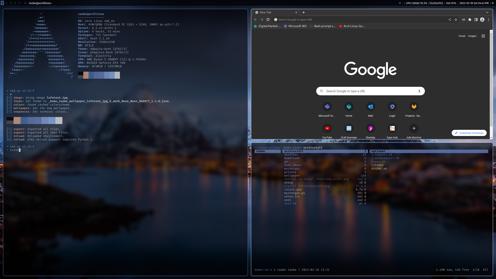
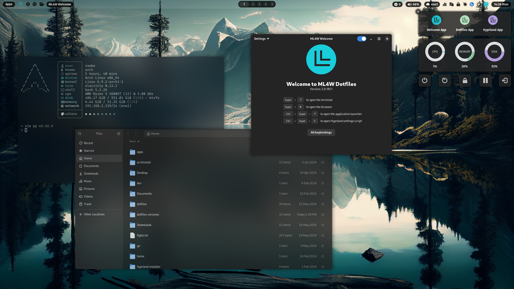
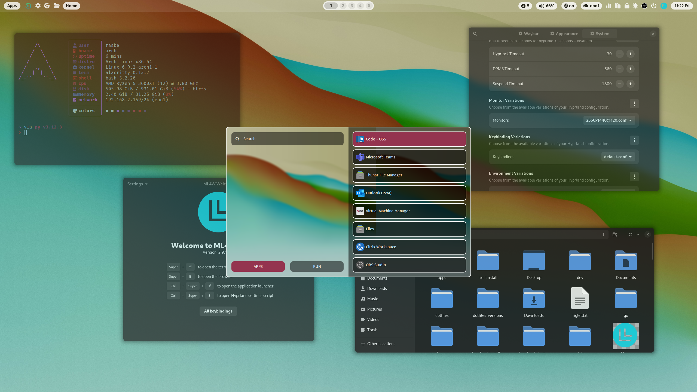
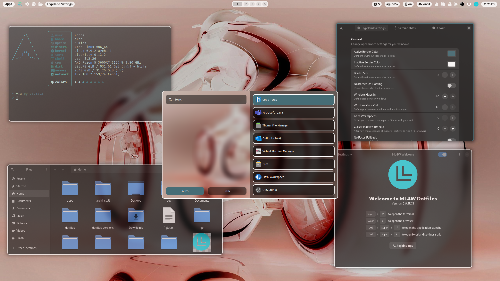

# ML4W Dotfiles 2.9.1

An advanced configuration of Hyprland for Arch Linux based distributions. This package includes an installation script to install and setup the required components.

[](screenshots/screenshot2.png)

The ML4W Dotfiles are available as 

- main release (Official release): [https://gitlab.com/stephan-raabe/dotfiles](https://gitlab.com/stephan-raabe/dotfiles)
- rolling release (Development release): [https://gitlab.com/stephan-raabe/dotfiles/-/tree/dev](https://gitlab.com/stephan-raabe/dotfiles/-/tree/dev)

YouTube Video [https://youtu.be/HMxHUvN6VGo](https://youtu.be/HMxHUvN6VGo)

## Installation

The easiest way is to use the setup.sh script. The script will download all files from GitLab and start the installation.

Just copy/enter the following command into your terminal.

```
bash <(curl -s https://gitlab.com/stephan-raabe/dotfiles/-/raw/main/setup.sh)
```

> PLEASE NOTE: Every Linux distribution and setup can be different. Therefore, I cannot guarantee that the installation will work everywhere. Installation on your own risk.

## Wiki

You can find the complete documentation of the ML4W Dotfiles in the Wiki. <b>[Open the Wiki here](https://gitlab.com/stephan-raabe/dotfiles/-/wikis/home)</b>

## Screenshots

[](screenshots/screenshot1.png)

[](screenshots/screenshot3.png)

[](screenshots/screenshot5.png)

## Wallpaper repository

You can find my wallpaper collection in the repository https://gitlab.com/stephan-raabe/wallpaper

## Special Thanks

THANK YOU very much for all your support, contributions and ideas:

- Diana Ward: https://github.com/dianaw353
- Don Williams: https://github.com/dwilliam62
- Teodor Orzechowski: https://gitlab.com/sq6gtt
- Jamie Deppeler: https://gitlab.com/bknight2k
- https://gitlab.com/muee

and many more...

Thanks to all YouTube subscribers for all your great feedback.

## Inspirations

The following projects have inspired me:

- https://github.com/prasanthrangan/hyprdots
- https://github.com/sudo-harun/dotfiles
- https://github.com/dianaw353/hyprland-configuration-rootfs

and many more...
