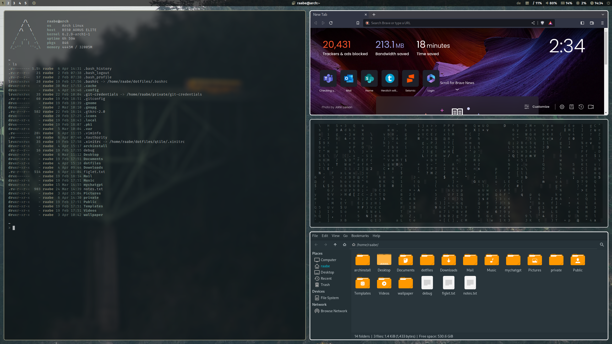

# dotfiles

This is the configuration of my Arch linux based installation.

Window Manager: qtile
Compositor: picom
Terminal: alacritty
Editor: nvim
Prompt: starship
Bar: polybar
Icons: Font Awesome
Menus: Rofi
Colorscheme: pywal
Browser: brave
Filemanager: ranger, Thunar
Screenshots: scrot
Virtual Machine: qemu (Windows 11 with looking glass and xrdp)

Please also see the script folder how I setup my system.

Included is a pywal configuration that changes the color scheme based on a randomly selected wallpaper. Just type w in a terminal (or SuperKey + Shift + w). SuperKey + Ctrl + w opens rofi with a list of installed wallpapers for individual selection. See also the .bashrc for more alias definitions.

## Screenshot



You can find more screenshots in the screenshots folder.

## Getting started

To make it easy for you to get started with my dotfiles, here's a list of recommended next steps.

```
# Clone the repository
git clone https://gitlab.com/stephan-raabe/dotfiles.git

# Install all required packages
./1-install.sh

# Install qtile window manager
./2-qtile.sh

```


