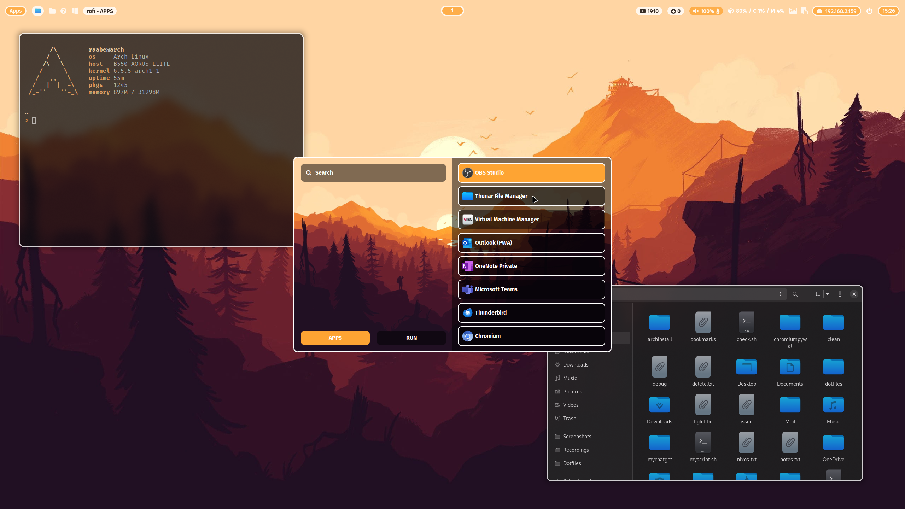
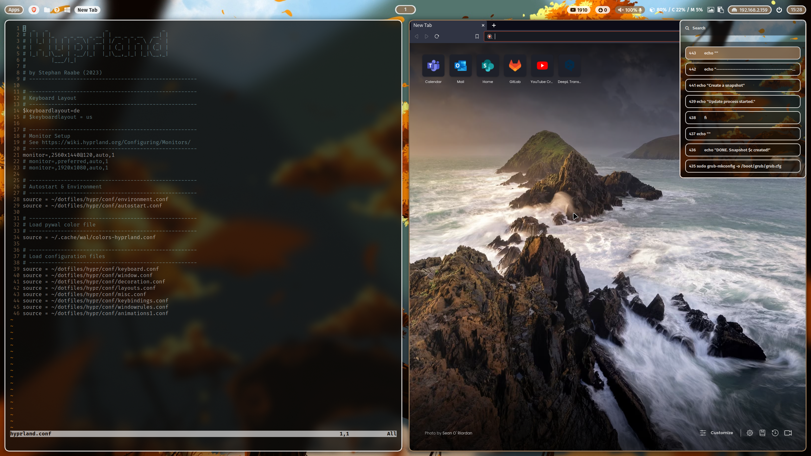

# ML4W dotfiles

This is the configuration of my Arch linux based installation for Hyprland (Wayland) and Qtile (Xorg).

## Common Packages

- Terminal: alacritty
- Editor: nvim
- Prompt: starship
- Icons: Font Awesome
- Menus: Rofi
- Colorscheme: pywal (dynamic)
- Browsers: brave, chromium
- Filemanager: Neutilus, ranger, Thunar
- Cursor: Bibata Modern Classic
- Icons: Kora-Icon-Theme
- Theme: Breeze-dark
- Virtual Machine: qemu (Windows 11 with looking glass and xrdp)

## Hyprland

- Status Bar: waybar
- Screenshots: grim & slurp
- Clipboard Manager: cliphist
- Logout: wlogout
- Screenlock: swaylock-effects

## Qtile

- Compositor: picom
- Status Bar: polybar
- Screenshots: scrot

## Templating

Included is a pywal configuration that changes the color scheme based on a randomly selected wallpaper. With the key binding SuperKey + Shift + w you can change the wallpaper. SuperKey + Ctrl + w opens rofi with a list of installed wallpapers for your individual selection. See also the .bashrc and the key bindings on Hyprland and Qtile for more alias definitions.

## Screenshots & Video

<a href="https://youtu.be/ELEQh0z3lm8" target="_blank"></a>

<a href="https://youtu.be/ELEQh0z3lm8" target="_blank"></a>

<a href="https://youtu.be/ELEQh0z3lm8" target="_blank"></a>

<a href="https://youtu.be/ELEQh0z3lm8" target="_blank">Watch on YouTube</a>

<b><a href="https://gitlab.com/stephan-raabe/dotfiles/-/tree/main/screenshots?ref_type=heads">You can find more screenshots here.</a></b>

## Getting started

To make it easy for you to get started with my dotfiles, here's a list of recommended next steps.

PLEASE BACKUP YOUR EXISTING .config WITH YOUR DOTFILES BEFORE STARTING THE SCRIPTS.

```
# Make sure that you're in your home directory
cd

# Clone the repository from your home directory
git clone https://gitlab.com/stephan-raabe/dotfiles.git

# Or download the lastest version and unzip into ~/dotfiles folder

# Change into the new dotfiles folder
cd dotfiles

# Install all required packages
./1-install.sh

# Install hyprland window manager
./2-install-hyprland.sh
# OR/AND Install qtile window manager
./2-install-qtile.sh

# Install dotfiles
./3-install-dotfiles.sh

```
Please note that every Arch Linux system is different and I cannot guarantee that everything works fine on your system.

