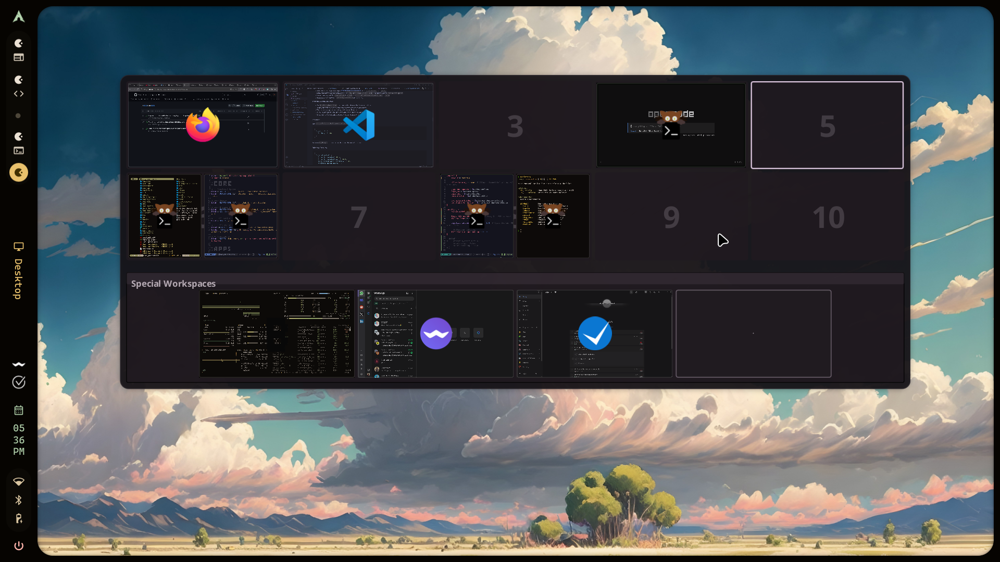
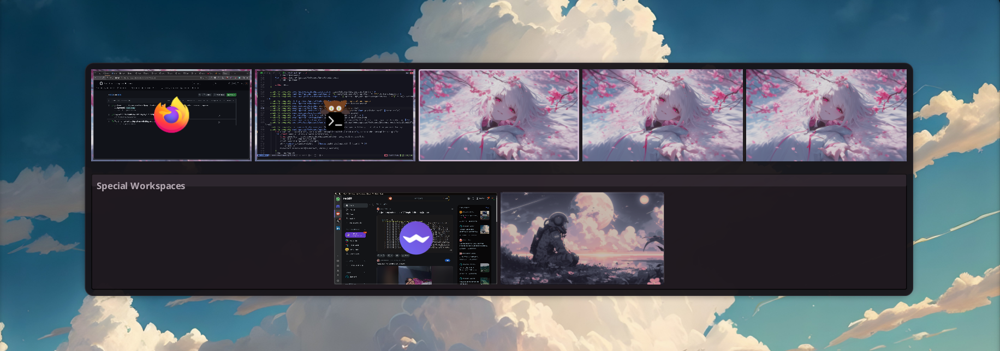

# Quickshell Overview for Hyprland

<div align="center">

A standalone workspace overview module for Hyprland using Quickshell - shows all workspaces with live window previews, drag-and-drop support, and Super+Tab keybind.


</div>

---

## 📸 Preview



https://github.com/user-attachments/assets/e8f392d7-d831-4dec-9cd3-fb93d1ccc21c

> *Workspace overview showing live window previews with drag-and-drop support*

---

## ✨ Features

- 🖼️ Visual workspace overview showing all workspaces and windows
- 🖥️ Multi-monitor support with proper scaling and vertical/rotated monitors [in experimental branch]
- 📐 Smart row hiding - optionally hide empty workspace rows
- 🎯 Click windows to focus them
- 🖱️ Middle-click windows to close them  
- 🔄 Drag and drop windows between workspaces
- ⌨️ Keyboard navigation (Arrow keys, vim keys, number shortcuts)
- 🖱️ Auto-close on focus loss / outside click
- 💡 Hover tooltips showing window information
- 🎨 Material Design 3 theming
- ⚡ Smooth animations and transitions

## 📦 Installation

### Arch Linux (AUR)

For Arch Linux users, you can install directly from the AUR:

```bash
# Using yay
yay -S quickshell-overview-git

# Using paru
paru -S quickshell-overview-git
```

On AUR installs, module files are package-managed under:

```text
/etc/xdg/quickshell/overview/
```

Put your custom settings in:

```text
~/.config/quickshell/overview/config.json
```

Then add the keybind and auto-start to your Hyprland config (see Setup steps 2-4 below).

### Prerequisites

- **Hyprland** compositor
- **Quickshell** ([installation guide](https://quickshell.org/docs/v0.1.0/guide/install-setup/))
- **Qt 6** with modules: QtQuick, QtQuick.Controls

### Setup

1. **Install module files** (choose one):
   - **Git clone (manual install):**
   ```bash
   git clone https://github.com/Shanu-Kumawat/quickshell-overview ~/.config/quickshell/overview
   ```
   - **AUR package:** use the command above (`yay -S quickshell-overview-git` or `paru -S ...`)

2. **Add keybind** to your Hyprland config:

   *For Hyprland 0.55+ (`~/.config/hypr/hyprland.lua`):*
   ```lua
   hl.bind("SUPER + TAB", hl.dsp.exec_cmd("qs ipc -c overview call overview toggle"))
   ```
   *For Hyprland 0.54 and older (`~/.config/hypr/hyprland.conf`):*
   ```conf
   bind = Super, TAB, exec, qs ipc -c overview call overview toggle
   ```

4. **Auto-start** the overview (add to Hyprland config):

   *For Hyprland 0.55+ (`~/.config/hypr/hyprland.lua`):*
   ```lua
   hl.on("hyprland.start", function () 
       hl.exec_cmd("qs -c overview")
   end)
   ```
   *For Hyprland 0.54 and older (`~/.config/hypr/hyprland.conf`):*
   ```conf
   exec-once = qs -c overview
   ```

6. **Reload Hyprland**:
   ```bash
   hyprctl reload
   ```

### Manual Start (if needed)

```bash
qs -c overview &
```

### NixOS

For NixOS users, ensure Quickshell has access to required Qt6 modules:

```nix
# In your configuration.nix or home-manager config
environment.systemPackages = with pkgs; [
  quickshell
  qt6.qtwayland
];
```

If you're using home-manager:

```nix
home.packages = with pkgs; [
  quickshell
  qt6.qtwayland
];
```

## 🎮 Usage

| Action | Description |
|--------|-------------|
| **Super + Tab** | Toggle the overview |
| **Arrow Keys / h/l** | Navigate left/right within current row* |
| **Up/Down / j/k** | Navigate between workspace rows |
| **1-9, 0** | Jump to Nth workspace in current group (0 = 10th) |
| **Mouse wheel on grid** | Move across all normal workspaces, wrapping from last to first |
| **Escape / Enter** | Close the overview |
| **Click outside overview** | Close the overview when `overview.closeOnFocusLoss` is enabled (default) |
| **Click workspace** | Switch to that workspace |
| **Click window** | Focus that window |
| **Middle-click window** | Close that window |
| **Drag window** | Move window to different workspace |

> *When `hideEmptyRows` is enabled, left/right navigation wraps within the current visible row for better UX

---

## ⚙️ Configuration

> **⚠️ Want to change size, position, workspace count, or toggles?**
> Create/edit `~/.config/quickshell/overview/config.json`.

`Config.qml` inside the module is now treated as defaults. User overrides are read from:

- `$XDG_CONFIG_HOME/quickshell/overview/config.json`
- fallback: `~/.config/quickshell/overview/config.json`

> **Note:** After editing `config.json`, manually restart overview for changes to apply:
> `qs ipc -c overview call overview close && qs -c overview`

### Quick Start

```bash
mkdir -p ~/.config/quickshell/overview
cp /etc/xdg/quickshell/overview/config.example.json ~/.config/quickshell/overview/config.json
```

If you installed from git clone instead of AUR, copy from your repo path:

```bash
cp ~/.config/quickshell/overview/config.example.json ~/.config/quickshell/overview/config.json
```

### Workspace Grid

Edit `~/.config/quickshell/overview/config.json`:

```json
{
  "overview": {
    "rows": 2,
    "columns": 5,
    "scale": 0.16,
    "enable": true,
    "hideEmptyRows": true,
    "closeOnFocusLoss": true,
    "useWorkspaceMap": false,
    "workspaceMap": [0, 10],
    "orderRightLeft": false,
    "orderBottomUp": false,
    "previewsEnabled": true,
    "previewMode": "live",
    "includeInactiveMonitorPreviews": true,
    "previewRecaptureDelayMs": 60,
    "showSpecialWorkspaces": true,
    "specialWorkspaces": [],
    "specialWorkspaceColumns": 5,
    "emptyWorkspaceWallpaper": "",
    "specialEmptyWorkspaceWallpaper": "",
    "effects": {
      "enableBackdrop": false,
      "backdropOpacity": 0.28,
      "panelOpacity": 0.92,
      "workspaceOpacity": 0.86,
      "emptyWorkspaceWallpaperOverlayOpacity": 0.18,
      "windowOverlayOpacity": 0.22,
      "enableBlur": false,
      "glassMode": false,
      "glassTintStrength": 0.35,
      "glassBorderOpacity": 0.72,
      "glassShineOpacity": 0.14
    },
    "workspaceSpacing": 5,
    "backgroundPadding": 10,
    "workspaceNumberBaseSize": 250
  }
}
```

**Common adjustments:**
- **Too small?** Increase `scale` (try 0.20 or 0.25)
- **Too big?** Decrease `scale` (try 0.12 or 0.14)
- **More workspaces?** Change `rows` and `columns` (e.g., 3 rows × 4 columns = 12 workspaces)
- **Reverse order?** Set `orderRightLeft` and/or `orderBottomUp` to `true`
- **Prefer the overview to stay open after outside clicks/focus changes?** Set `closeOnFocusLoss` to `false`
- **Per-monitor workspace groups?** Enable `useWorkspaceMap` and set `workspaceMap` (e.g. `[0,10]`)
- **Show special workspaces below grid?** Keep `showSpecialWorkspaces: true` and optionally prefill `specialWorkspaces`
- **Lower memory use?** Set `previewMode` to `event` and `includeInactiveMonitorPreviews` to `false`
- **Transparency / blur?** Tune `overview.effects.*` (details below)

**Hide empty workspace rows:**
- Set `hideEmptyRows: true` to automatically hide rows that have no windows
- Keeps your overview clean by only showing rows with active workspaces
- The current workspace row is always visible, even if empty
- Arrow key navigation (left/right) stays within the current row when enabled
- Great for 2-row setups where you rarely use workspaces 6-10

**Close on focus loss / outside click:**
- `closeOnFocusLoss` defaults to `true`
- When enabled, clicking outside the overview closes it, similar to menus, dropdowns, and launchers
- The overview also closes when its Hyprland focus grab is cleared
- Set `closeOnFocusLoss: false` if you want the previous behavior where the overview can remain open after focus changes

### Position

Edit `~/.config/quickshell/overview/config.json`:

```json
{
  "position": {
    "topMargin": 100
  }
}
```

Increase `topMargin` to move the overview down. Decrease it to move up.

### Window Preview

```json
{
  "windowPreview": {
    "showIcons": true,
    "iconToWindowRatio": 0.25,
    "iconToWindowRatioCompact": 0.45,
    "xwaylandIndicatorToIconRatio": 0.35,
    "inactiveMonitorOpacity": 0.4,
    "cropToFill": false
  }
}
```

- `cropToFill`: crop full-screen windows to fill the workspace preview when `true`; keep the full window in preview with possible horizontal/vertical "padding" bars when `false`

### Performance Tuning

```json
{
  "overview": {
    "previewsEnabled": true,
    "previewMode": "live",
    "includeInactiveMonitorPreviews": true,
    "previewRecaptureDelayMs": 60
  },
  "hacks": {
    "hyprlandEventDebounceMs": 40
  }
}
```

- `overview.previewsEnabled`: turn all window screencopy previews on/off
- `overview.previewMode`: `live` (best visuals, more RAM) or `event` (lower RAM, refreshes on window events)
- `overview.includeInactiveMonitorPreviews`: when `false`, only current monitor windows get preview capture
- `overview.previewRecaptureDelayMs`: delay used for event-mode snapshot refresh (lower = faster updates)
- `hacks.hyprlandEventDebounceMs`: coalesces Hyprland event refreshes to reduce command churn

### Special Workspaces

```json
{
  "overview": {
    "showSpecialWorkspaces": true,
    "specialWorkspaces": ["stash", "music", "scratch"],
    "specialWorkspaceColumns": 5
  }
}
```

- `showSpecialWorkspaces`: renders special workspaces in a strip under the normal grid
- `specialWorkspaces`: optional preconfigured special workspace names (without the `special:` prefix)
- `specialWorkspaceColumns`: how many special tiles per row before wrapping
- `emptyWorkspaceWallpaper`: optional image path used as the background for normal workspace tiles
- `specialEmptyWorkspaceWallpaper`: optional image path used as the background for special workspace tiles

Interaction behavior:
- Preconfigured special workspaces appear in the overview even when they are empty
- The special strip shows active special workspaces plus any names you preconfigure
- This is useful for fixed workflows like `stash`, `music`, or `scratch`
- Click a special tile to run `togglespecialworkspace <name>`
- Click the `+` tile to create and open a new special workspace
- Drag a window onto a special tile to move it with `movetoworkspacesilent special:<name>`
- Drag a window onto the `+` tile to auto-create a new special workspace (`stash`, `stash-2`, ...), even when no special workspace is currently open or preconfigured
- Special windows are visible directly in those tiles
- Restart Quickshell after changing `config.json`, otherwise the special workspace list will not refresh immediately

Normal workspace scrolling:
- Scroll on the normal workspace grid to move the active workspace/highlighter across all normal workspaces
- Scrolling wraps from the last workspace back to `1`, and from `1` back to the last

### Workspace Wallpaper

```json
{
  "overview": {
    "emptyWorkspaceWallpaper": "/home/your-user/Pictures/wallpaper.png",
    "specialEmptyWorkspaceWallpaper": "/home/your-user/Pictures/special-wallpaper.png",
    "effects": {
      "emptyWorkspaceWallpaperOverlayOpacity": 0.12
    }
  }
}
```

- Normal workspaces can use a wallpaper as their background
- Special workspaces can use a different wallpaper as their background
- The wallpaper remains visible behind floating or partially covered windows
- If no special workspaces exist yet, that special wallpaper is also used for the `+` create tile
- `emptyWorkspaceWallpaperOverlayOpacity` controls how much tint is applied over that wallpaper
- Use an absolute path for the image for the most reliable behavior
- Restart Quickshell after changing `config.json`, otherwise the wallpaper path will not refresh immediately

Demo:



### Transparency & Blur

```json
{
  "overview": {
    "effects": {
      "enableBackdrop": false,
      "backdropOpacity": 0.28,
      "panelOpacity": 0.92,
      "workspaceOpacity": 0.86,
      "emptyWorkspaceWallpaperOverlayOpacity": 0.18,
      "windowOverlayOpacity": 0.22,
      "enableBlur": false,
      "glassMode": false,
      "glassTintStrength": 0.35,
      "glassBorderOpacity": 0.72,
      "glassShineOpacity": 0.14
    }
  }
}
```

- `enableBackdrop`: show/hide full-screen dim backdrop behind overview
- `backdropOpacity`: opacity of backdrop dim layer (`0` to `1`)
- `panelOpacity`: opacity of overview panel container (`0` to `1`)
- `workspaceOpacity`: opacity of each workspace tile (`0` to `1`)
- `emptyWorkspaceWallpaperOverlayOpacity`: tint strength over empty-workspace wallpaper (`0` to `1`)
- `windowOverlayOpacity`: opacity of the color tint over window previews (`0` to `1`)
- `enableBlur`: switches layer namespace to `quickshell:overview-blur`
- `glassMode`: enables a glass-like tint + softer transparency preset for panel/workspaces/windows
- `glassTintStrength`: tint mixing strength for glass mode (`0` to `1`)
- `glassBorderOpacity`: border alpha used by glass mode (`0` to `1`)
- `glassShineOpacity`: top highlight strength for glass reflections (`0` to `1`)

Stronger glass preset:

```json
{
  "overview": {
    "effects": {
      "enableBackdrop": true,
      "enableBlur": true,
      "panelOpacity": 0.55,
      "workspaceOpacity": 0.48,
      "emptyWorkspaceWallpaperOverlayOpacity": 0.10,
      "windowOverlayOpacity": 0.08,
      "glassMode": true,
      "glassTintStrength": 0.55,
      "glassBorderOpacity": 0.85,
      "glassShineOpacity": 0.32
    }
  }
}
```

For Hyprland blur, add layer rules (example):

```ini
layerrule = blur true, match:namespace quickshell:overview-blur
layerrule = ignore_alpha 0.2, match:namespace quickshell:overview-blur
```

If `enableBlur` is `false`, namespace remains `quickshell:overview`.

Low-memory preset:

```json
{
  "overview": {
    "previewMode": "event",
    "includeInactiveMonitorPreviews": false
  },
  "hacks": {
    "hyprlandEventDebounceMs": 80
  }
}
```

### Full Example

```json
{
  "appearance": {
    "colorSource": "default",
    "caelestia": {
      "autoRefresh": true,
      "refreshInterval": 2000,
      "accentProfile": "vibrant"
    },
    "rounding": {
      "unsharpen": 2,
      "verysmall": 8,
      "small": 12,
      "normal": 17,
      "large": 23,
      "full": 9999,
      "screenRounding": 23,
      "windowRounding": 18
    },
    "font": {
      "family": {
        "main": "sans-serif",
        "title": "sans-serif",
        "expressive": "sans-serif"
      },
      "pixelSize": {
        "smaller": 12,
        "small": 15,
        "normal": 16,
        "larger": 19,
        "huge": 22
      }
    },
    "animation": {
      "duration": {
        "elementMove": 500,
        "elementMoveEnter": 400,
        "elementMoveFast": 200
      }
    },
    "sizes": {
      "elevationMargin": 10
    }
  },
  "overview": {
    "rows": 2,
    "columns": 5,
    "scale": 0.16,
    "enable": true,
    "hideEmptyRows": true,
    "closeOnFocusLoss": true,
    "useWorkspaceMap": false,
    "workspaceMap": [0, 10],
    "orderRightLeft": false,
    "orderBottomUp": false,
    "previewsEnabled": true,
    "previewMode": "live",
    "includeInactiveMonitorPreviews": true,
    "previewRecaptureDelayMs": 60,
    "showSpecialWorkspaces": true,
    "specialWorkspaces": [],
    "specialWorkspaceColumns": 5,
    "emptyWorkspaceWallpaper": "",
    "specialEmptyWorkspaceWallpaper": "",
    "effects": {
      "enableBackdrop": false,
      "backdropOpacity": 0.28,
      "panelOpacity": 0.92,
      "workspaceOpacity": 0.86,
      "emptyWorkspaceWallpaperOverlayOpacity": 0.18,
      "windowOverlayOpacity": 0.22,
      "enableBlur": false,
      "glassMode": false,
      "glassTintStrength": 0.35,
      "glassBorderOpacity": 0.72,
      "glassShineOpacity": 0.14
    },
    "workspaceSpacing": 5,
    "backgroundPadding": 10,
    "workspaceNumberBaseSize": 250
  },
  "position": {
    "topMargin": 100
  },
  "windowPreview": {
    "showIcons": true,
    "iconToWindowRatio": 0.25,
    "iconToWindowRatioCompact": 0.45,
    "xwaylandIndicatorToIconRatio": 0.35,
    "inactiveMonitorOpacity": 0.4,
    "cropToFill": false
  },
  "hacks": {
    "arbitraryRaceConditionDelay": 150,
    "hyprlandEventDebounceMs": 40
  }
}
```

### Theme & Colors

Most theme sizing/timing options are now configurable via `config.json`:
- `appearance.colorSource` (`default`, `matugen`, `caelestia`)
- `appearance.caelestia.*` (`autoRefresh`, `refreshInterval`, `accentProfile`)
- `appearance.rounding.*`
- `appearance.font.*`
- `appearance.animation.duration.*`
- `appearance.sizes.elevationMargin`

For full color palette customization, edit `~/.config/quickshell/overview/common/Appearance.qml`.

### Matugen (Dynamic Colors from Wallpaper)

[Matugen](https://github.com/InioX/matugen) lets you generate Material You colors from your wallpaper and apply them to the overview automatically.

**1. Install matugen** - follow [matugen's install guide](https://github.com/InioX/matugen?tab=readme-ov-file#installation)

**2. Copy the template** from this repo to matugen's templates folder:
```bash
mkdir -p ~/.config/matugen/templates
cp ~/.config/quickshell/overview/quickshell-overview.qml ~/.config/matugen/templates/
```

**3. Add this to `~/.config/matugen/config.toml`** (create the file if it doesn't exist):
```toml
[templates.quickshell_overview]
input_path  = "./templates/quickshell-overview.qml"
output_path = "~/.config/quickshell/overview/common/Appearance.colors.qml"
```

**4. Enable it** in `~/.config/quickshell/overview/config.json`:
```json
{
  "appearance": {
    "colorSource": "matugen"
  }
}
```

**5. Run matugen** with your wallpaper to generate colors:
```bash
matugen image /path/to/your/wallpaper.jpg
```

This generates `Appearance.colors.qml` which the overview loads automatically. Re-run step 5 whenever you change your wallpaper.

### Caelestia

If you use Caelestia, set the source to `caelestia`:

```json
{
  "appearance": {
    "colorSource": "caelestia",
    "caelestia": {
      "autoRefresh": true,
      "refreshInterval": 2000,
      "accentProfile": "vibrant"
    }
  }
}
```

Overview reads the active palette from `caelestia scheme get` and refreshes it live when `autoRefresh` is enabled, so wallpaper/scheme changes can apply without restarting overview.

---

## 📋 Requirements

- **Hyprland** compositor (tested on latest versions)
- **Quickshell** (Qt6-based shell framework)
- **Qt 6** with the following modules:
  - QtQuick
  - QtQuick.Controls
  - QtQuick.Layouts
  - Quickshell.Wayland
  - Quickshell.Hyprland

## 🚫 Removed Features (from original illogical-impulse)

The following features were removed to make it standalone:

- App search functionality
- Emoji picker
- Clipboard history integration
- Search widget
- Integration with the full illogical-impulse shell ecosystem

## 📁 File Structure

```
~/.config/quickshell/overview/
├── shell.qml                      # Main entry point
├── README.md                      # This file
├── config.example.json            # User override template
├── hyprland-config.conf          # Configuration reference
├── common/
│   ├── Appearance.qml            # Theme and styling
│   ├── Config.qml                # Default config + user override loader
│   ├── functions/
│   │   └── ColorUtils.qml        # Color manipulation utilities
│   └── widgets/
│       ├── StyledText.qml        # Styled text component
│       ├── StyledRectangularShadow.qml
│       ├── StyledToolTip.qml
│       └── StyledToolTipContent.qml
├── services/
│   ├── GlobalStates.qml          # Global state management
│   └── HyprlandData.qml          # Hyprland data provider
└── modules/
    └── overview/
        ├── Overview.qml          # Main overview component
        ├── OverviewWidget.qml    # Workspace grid widget
        └── OverviewWindow.qml    # Individual window preview
```

## 🎯 IPC Commands

```bash
# Toggle overview
qs ipc -c overview call overview toggle

# Open overview
qs ipc -c overview call overview open

# Close overview  
qs ipc -c overview call overview close
```

## 🐛 Known Issues

- Window icons may fallback to generic icon if app class name doesn't match icon theme
- Potential crashes during rapid window state changes due to Wayland screencopy buffer management

## 💖 Support

If this project helps your setup and you want to support continued maintenance, you can sponsor here:

https://github.com/sponsors/Shanu-Kumawat

##  Credits

Extracted from the overview feature in [illogical-impulse](https://github.com/end-4/dots-hyprland) by [end-4](https://github.com/end-4).

Adapted as a standalone component for Hyprland + Quickshell users who want just the overview functionality.

---

<div align="center">

**Note:** Maintenance will be limited due to time constraints, but **PRs and code improvements are welcome!** Feel free to contribute or fork for your own needs.

Made with ❤️ for the Hyprland community

</div>
